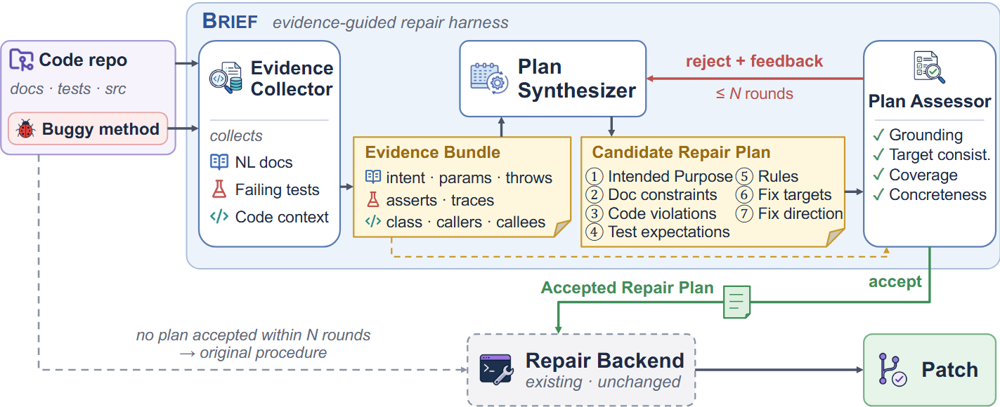

<p align="center">
  <h1 align="center">BRIEF</h1>
  <p align="center">
    <strong>An Evidence-Assessed Repair-Intent Interface for LLM-Based Program Repair</strong>
  </p>
</p>


---

BRIEF is an evidence-guided repair harness that externalizes repair intent as an explicit, evidence-assessed interface between project evidence and patch generation. It collects NL documentation, failing tests, and code context, and synthesizes them into a structured Repair Plan that captures intended behavior, observed violations, repair requirements, target locations, and repair direction. A Plan Assessor checks the plan against its source evidence for grounding, target consistency, coverage, and concreteness, and rejected plans are refined before use. Only an accepted plan is supplied to the repair backend as structured context; the backend retains its native tools, patch generation, validation, and refinement loop, and falls back to its original procedure when no plan is accepted.

On all 835 bugs of [Defects4J](https://github.com/rjust/defects4j) with GPT-6-Luna, BRIEF raises the number of correctly fixed bugs from 59 to **256** with RepairAgent and from 203 to **327** with ReinFix.


## How It Works



Given a repair task, BRIEF works in four stages: evidence collection, plan synthesis, plan assessment and refinement, and integration with an existing repair backend.

## Environment Setup

1. **Prerequisites:**

- Ubuntu 22.04+ (devcontainer or native)
- Python 3.10+
- Java 11
- Perl with modules: `String::Interpolate`, `DBI`
- OpenAI API key

2. **Clone and prepare:**

```bash
cd RepairAgent/repair_agent
rm -rf defects4j
git clone https://github.com/rjust/defects4j.git
cp -r ../data/buggy-lines defects4j
cp -r ../data/buggy-methods defects4j
cd ..
```

3. **Quick Setup:**

```bash
# Clone repo
git clone <repo-url>
cd RepairAgent

# Install Java + Perl deps (system-wide, critical for subprocesses)
sudo apt-get update
sudo apt-get install -y openjdk-11-jdk subversion dos2unix cpanminus libdbi-perl
sudo cpanm String::Interpolate DBI

# Setup defects4j
cd repair_agent/defects4j
./init.sh
cd ..

# Install Python deps
pip install -r requirements.txt

# Set API key
export OPENAI_API_KEY="sk-..."
```

---

## Running Experiments
### 1.Run a Single Bug

```bash
cd repair_agent
export PATH=$PATH:$(pwd)/defects4j/framework/bin
python3 checkout_py.py Math 98
./run.sh --ai-settings ai_settings.yaml --model gpt-6-luna -c -l 40
```

### 2.Run a Batch of Bugs

```bash
cd repair_agent
./run_on_defects4j.sh experimental_setups/test_e35_bugs_list hyperparams.json gpt-6-luna
```

The bug list file format is: `Project BugNumber` per line with blank lines between.

### 3.Output Locations

After running, results are in `experimental_setups/experiment_N/`:
- `logs/prompt_history_{Bug}/` — full conversation transcripts
- `responses/model_responses_{Bug}` — raw model responses
- `plausible_patches/plausible_patches_{Bug}.json` — successful patches
- `spec_logs/` — generated specs (parsed JSON + injected prompt text)
- `saved_contexts/` — agent state snapshots
- `mutations_history/` — fix attempt history

---
