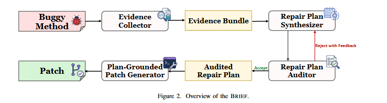

<p align="center">
  <h1 align="center">BRIEF</h1>
  <p align="center">
    <strong>No Intent, No Fix: Synthesizing Verified Behavioral
Plans to Ground Automated Program Repair</strong>
  </p>
</p>


---

BRIEF collects complementary evidence from NL documentation, failing tests, and surrounding code context, and synthesizes it into a structured behavioral repair plan stating intended behavior, fault locations, and repair requirements. An independent plan auditor screens the plan for unsupported claims and incomplete fault coverage, triggering revision when weaknesses are detected; the verified plan is then injected as persistent guidance into an LLM-based repair backend at each iteration, anchoring behavioral intent and reducing diagnostic drift.

On the [Defects4J](https://github.com/rjust/defects4j) benchmark, RepairAgent correctly fixed **217 bugs**, outperforming prior state-of-the-art tools.


## How It Works



Given a buggy method, BRIEF generates a patch through four stages: evidence collection, plan synthesis, plan auditing, and plan-grounded patch generation. 

## Environment Setup

1. **Prerequisites:**

- Ubuntu 22.04+ (devcontainer or native)
- Python 3.10+
- Java 11
- Perl with modules: `String::Interpolate`, `DBI`
- OpenAI API key

2. **Clone and prepare:**

   ```bash
   cd RepairAgent/repair_agent
   rm -rf defects4j
   git clone https://github.com/rjust/defects4j.git
   cp -r ../data/buggy-lines defects4j
   cp -r ../data/buggy-methods defects4j
   cd ..
   ```

3. **Quick Setup:**

```bash
# Clone repo
git clone <repo-url>
cd RepairAgent

# Install Java + Perl deps (system-wide, critical for subprocesses)
sudo apt-get update
sudo apt-get install -y openjdk-11-jdk subversion dos2unix cpanminus libdbi-perl
sudo cpanm String::Interpolate DBI

# Setup defects4j
cd repair_agent/defects4j
./init.sh
cd ..

# Install Python deps
pip install -r requirements.txt

# Set API key
export OPENAI_API_KEY="sk-..."
```

---

## Running Experiments
### 1.Run a Single Bug

```bash
cd repair_agent
export PATH=$PATH:$(pwd)/defects4j/framework/bin
python3 checkout_py.py Math 98
./run.sh --ai-settings ai_settings.yaml --model gpt-4o-mini -c -l 40
```

### 2.Run a Batch of Bugs

```bash
cd repair_agent
./run_on_defects4j.sh experimental_setups/test_e35_bugs_list hyperparams.json gpt-4o-mini
```

The bug list file format is: `Project BugNumber` per line with blank lines between.

### 3.Output Locations

After running, results are in `experimental_setups/experiment_N/`:
- `logs/prompt_history_{Bug}/` — full conversation transcripts
- `responses/model_responses_{Bug}` — raw model responses
- `plausible_patches/plausible_patches_{Bug}.json` — successful patches
- `spec_logs/` — generated specs (parsed JSON + injected prompt text)
- `saved_contexts/` — agent state snapshots
- `mutations_history/` — fix attempt history

---